# Tutorial — Erste Schritte mit nk-tool

Dieses Tutorial führt einmal komplett durch: eine Liegenschaft anlegen, eine Wohnung mit Mieter
und Zählern erfassen, eine Abrechnungsperiode + Kostenart anlegen und die erste (Mini-)Abrechnung
ansehen. Alle Screenshots zeigen einen frei erfundenen Beispiel-Datensatz.

> Die Screenshots wurden automatisiert mit Playwright erzeugt
> (`frontend/scripts/tutorial-screenshots.ts`) — bei UI-Änderungen einfach neu laufen lassen,
> siehe [CONTRIBUTING.md](../CONTRIBUTING.md).

## 1. Liegenschaft anlegen

Beim ersten Start ist noch nichts angelegt. Klicke auf **„Erste Liegenschaft anlegen"** (später,
wenn schon eine Liegenschaft existiert, das **+**-Symbol oben links in der Seitenleiste).

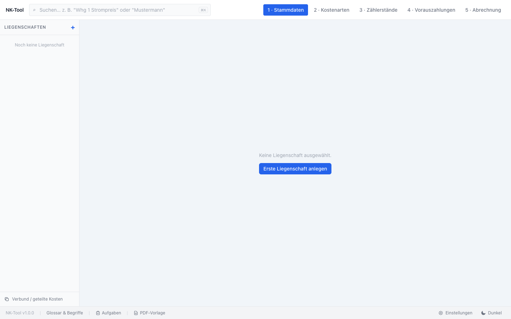

Trage Name, Adresse, PLZ und Ort ein. Heizungsart und Brennstoff-Einheit lassen sich jederzeit
später anpassen.

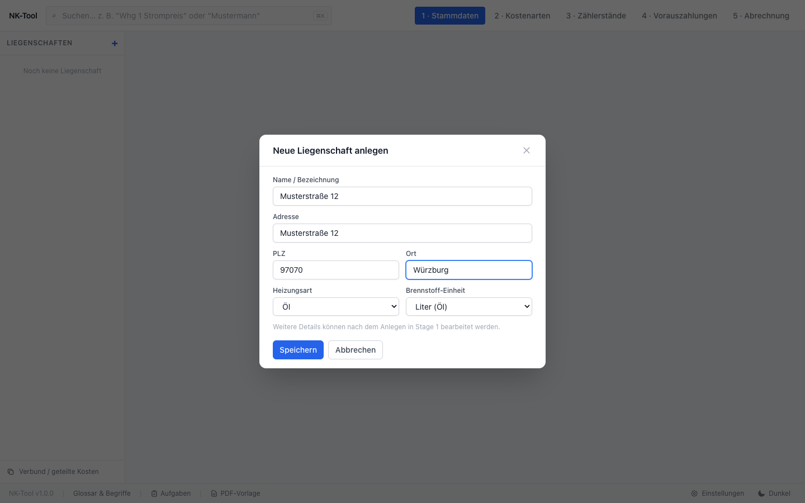

Nach dem Speichern landest du direkt in den Stammdaten der neuen Liegenschaft.

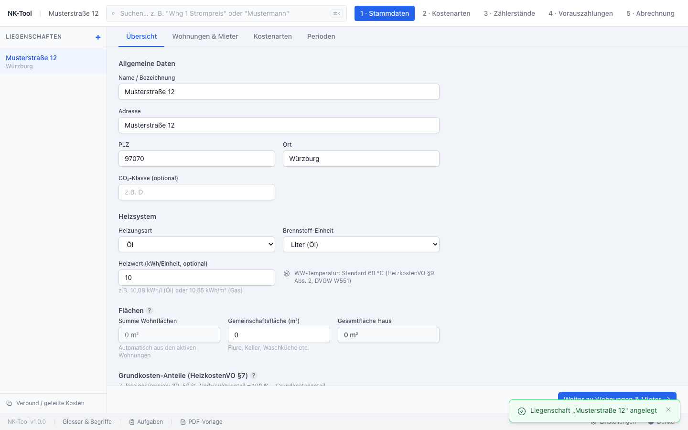

## 2. Wohnung, Mieter und Zähler anlegen

Im Tab **„Wohnungen & Mieter"** führt dich ein 3-Schritte-Assistent durch die komplette Erfassung
einer Wohnung auf einmal.

**Schritt 1 — Wohnung**: Bezeichnung und Fläche sind Pflicht. Die Fläche fließt in die meisten
flächenbasierten Kostenarten ein (Grundsteuer, Hausmeister, …), deshalb ist sie wichtig.

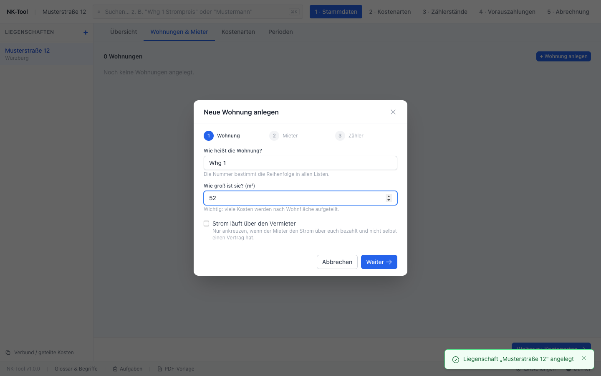

**Schritt 2 — Mieter** (optional, kann auch übersprungen werden für eine leerstehende Wohnung):

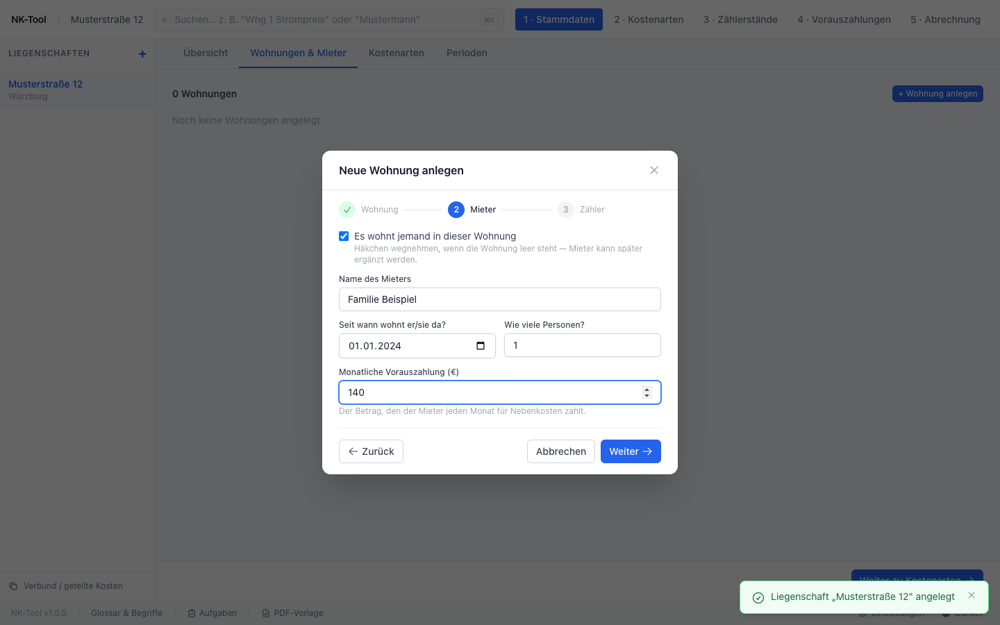

**Schritt 3 — Zähler**: Wärme-, Warmwasser- und Kaltwasserzähler sind vorausgewählt (abwählbar),
Gerätenummern können auch später nachgetragen werden.

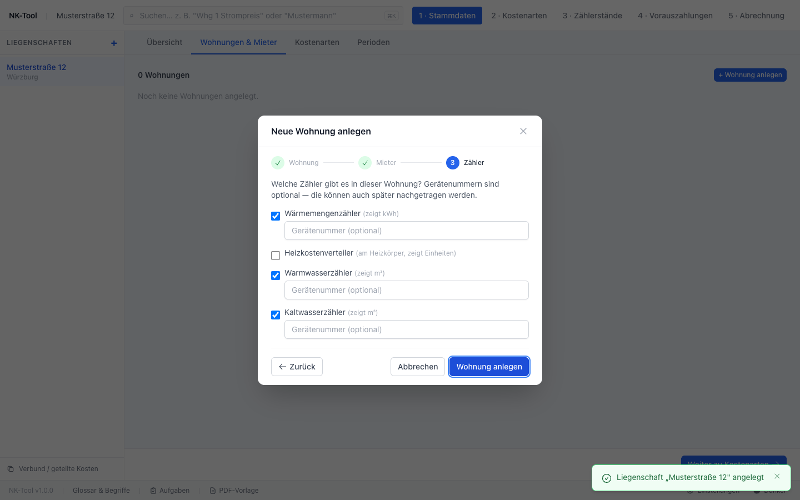

Nach „Wohnung anlegen" sind Wohnung, Mieter und Zähler in einem Rutsch da.

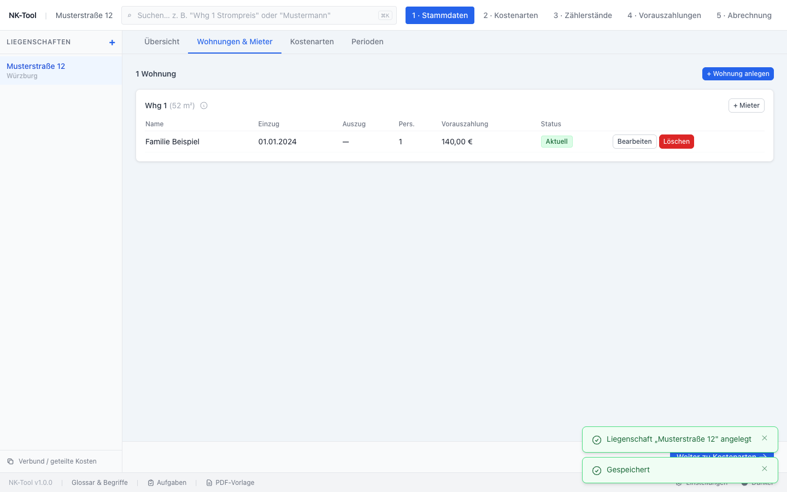

## 3. Abrechnungsperiode anlegen

Im Tab **„Perioden"** legst du den Abrechnungszeitraum fest (typischerweise ein Jahr).

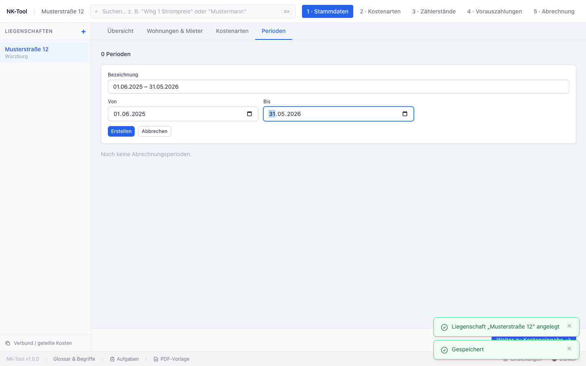

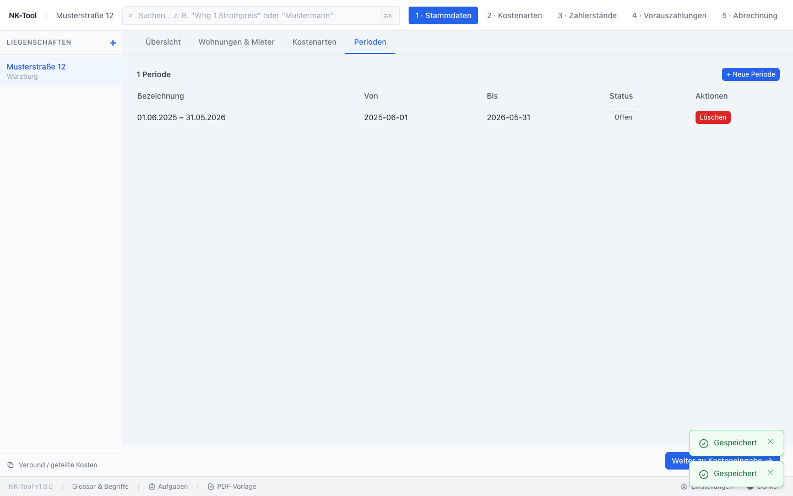

## 4. Kostenart mit Satz anlegen

Wechsle oben in der Kopfzeile zu **„2 · Kostenarten"** (das ist der laufende Abrechnungs-Workflow,
getrennt von den Stammdaten). Jede Kostenart ist eine eigene Kachel.

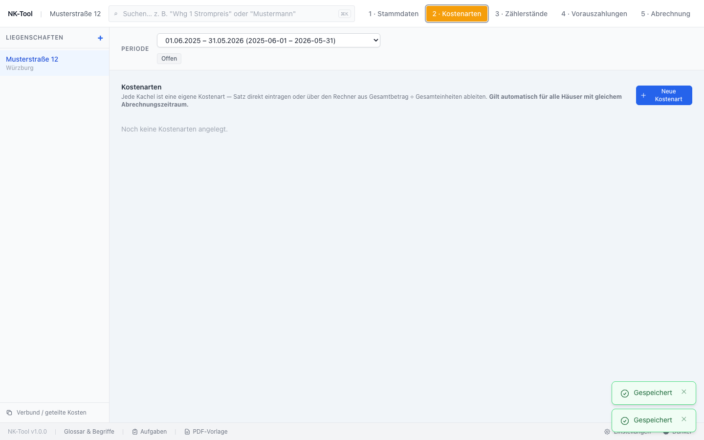

„+ Neue Kostenart" — Name eingeben, Verteilungsschlüssel wählen (hier: nach m²).

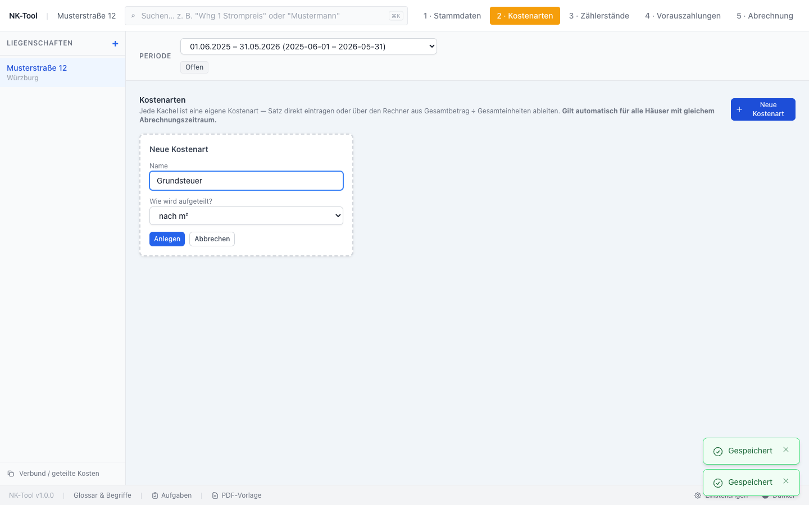

Satz eintragen (z. B. 2,10 €/m²) und speichern — **gilt automatisch für alle Häuser mit
demselben Abrechnungszeitraum**, falls du mehrere Liegenschaften verwaltest.

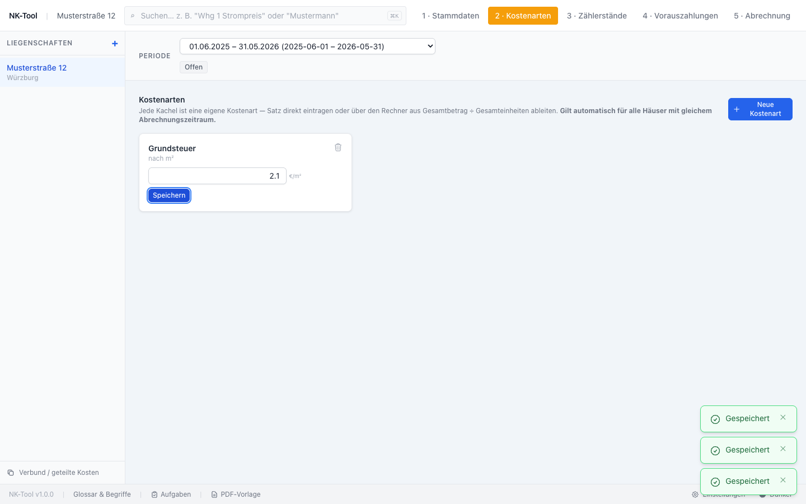

## 5. Zählerstände

**„3 · Zählerstände"** zeigt alle Wohnungen gruppiert nach Zählertyp (Heizung/Wasser/Strom). Klicke
auf Anfang/Ende, um Werte einzutragen — der Verbrauch wird automatisch berechnet.

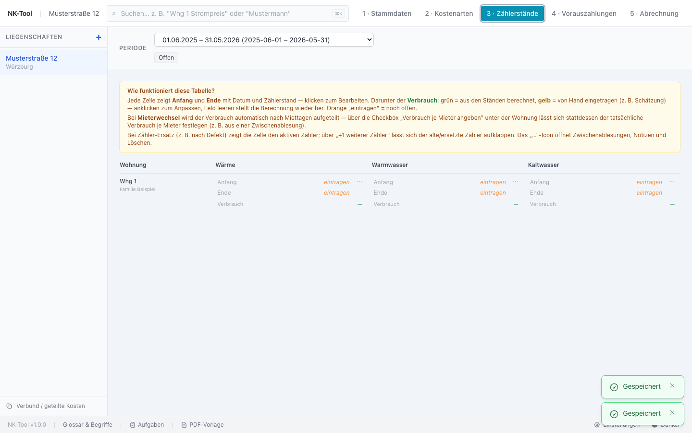

## 6. Vorauszahlungen

**„4 · Vorauszahlungen"** zeigt ein monatliches Raster pro Mieter. Oben steht der **gezahlte**
Betrag, darunter der **vereinbarte Soll-Betrag** (aus dem Anlege-Assistenten übernommen) — beides
anklickbar. Orange = noch nicht eingetragen, Grün = vollständig bezahlt.

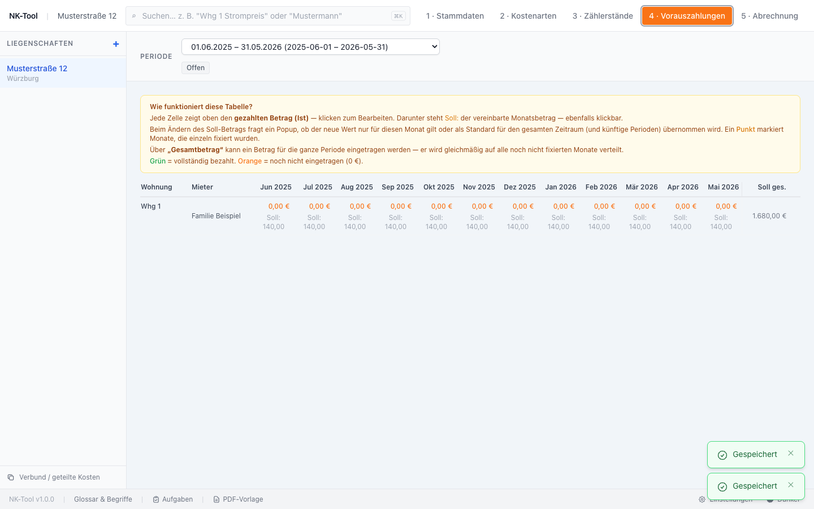

## 7. Abrechnung ansehen

**„5 · Abrechnung"** zeigt die berechnete Nebenkostenabrechnung je Mieter — live, sobald Kostenart-
Sätze und Zählerstände eingetragen sind. In diesem Beispiel ergeben 2,10 €/m² × 52 m² genau
109,20 € (noch ohne Vorauszahlungen, daher als Nachzahlung ausgewiesen).

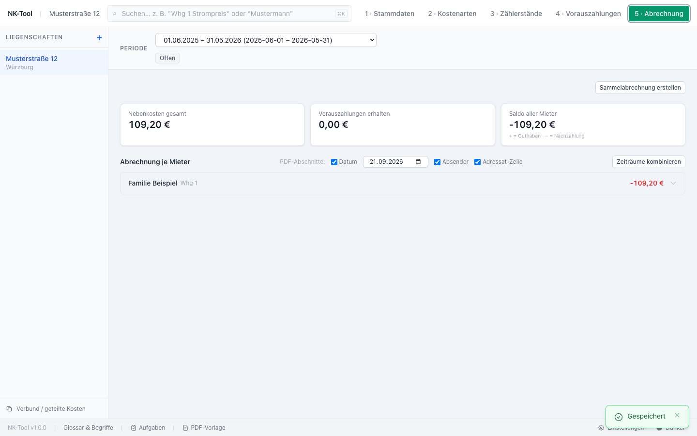

Von hier aus lässt sich pro Mieter eine PDF-Abrechnung erzeugen (Vorschau mit Drucken/
Herunterladen) — siehe die Klick-Pfeile neben jeder Zeile.

## Weiterführend

- **Liegenschafts-Verbund**: geteilte Kosten (z. B. gemeinsamer Hausmeister) auf mehrere Häuser
  aufteilen — Button „Verbund / geteilte Kosten" unten links in der Seitenleiste.
- **Ausprobieren-Modus**: Kostenart-Sätze anpassen und live sehen, wie sich die Salden aller
  Mieter ändern, ohne etwas zu speichern — Button „Mit angepassten Stammdaten ausprobieren"
  oben in der Abrechnung.
- **Glossar**: Fachbegriffe (Grundkosten, HKVO, Umlageschlüssel, …) — Button „Glossar & Begriffe"
  in der Fußzeile.
- Vollständige API-Referenz für Automatisierung/LLM-Zugriff: [AI_COMMANDS.md](../AI_COMMANDS.md).
